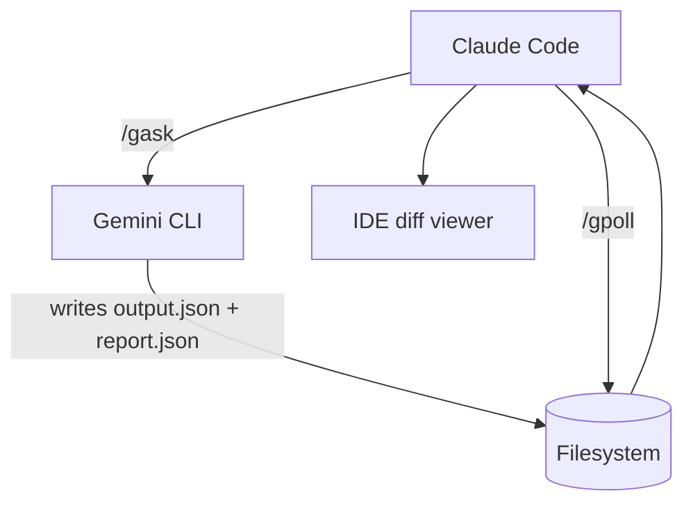

# Using Gemini CLI for Large Codebase Analysis

When analyzing large codebases or multiple files that might exceed context limits, use the Gemini CLI with its massive context window. Use `gemini -p` to leverage Google Gemini's large context capacity.

## File and Directory Inclusion Syntax

Use the `@` syntax to include files and directories in your Gemini prompts. The paths should be relative to WHERE you run the gemini command:

### Examples:

**Single file analysis:**
```bash
gemini -p "@src/main.py Explain this file's purpose and structure"
```

**Multiple files:**
```bash
gemini -p "@package.json @src/index.js Analyze the dependencies used in the code"
```

**Entire directory:**
```bash
gemini -p "@src/ Summarize the architecture of this codebase"
```

**Multiple directories:**
```bash
gemini -p "@src/ @tests/ Analyze test coverage for the source code"
```

**Current directory and subdirectories:**
```bash
gemini -p "@./ Give me an overview of this entire project"

# Or use --all_files flag:
gemini --all_files -p "Analyze the project structure and dependencies"
```

## Implementation Verification Examples

**Check if a feature is implemented:**
```bash
gemini -p "@src/ @lib/ Has dark mode been implemented in this codebase? Show me the relevant files and functions"
```

**Verify authentication implementation:**
```bash
gemini -p "@src/ @middleware/ Is JWT authentication implemented? List all auth-related endpoints and middleware"
```

**Check for specific patterns:**
```bash
gemini -p "@src/ Are there any React hooks that handle WebSocket connections? List them with file paths"
```

**Verify error handling:**
```bash
gemini -p "@src/ @api/ Is proper error handling implemented for all API endpoints? Show examples of try-catch blocks"
```

**Check for rate limiting:**
```bash
gemini -p "@backend/ @middleware/ Is rate limiting implemented for the API? Show the implementation details"
```

**Verify caching strategy:**
```bash
gemini -p "@src/ @lib/ @services/ Is Redis caching implemented? List all cache-related functions and their usage"
```

**Check for specific security measures:**
```bash
gemini -p "@src/ @api/ Are SQL injection protections implemented? Show how user inputs are sanitized"
```

**Verify test coverage for features:**
```bash
gemini -p "@src/payment/ @tests/ Is the payment processing module fully tested? List all test cases"
```

## When to Use Gemini CLI

Use `gemini -p` when:
- Analyzing entire codebases or large directories
- Comparing multiple large files
- Need to understand project-wide patterns or architecture
- Current context window is insufficient for the task
- Working with files totaling more than 100KB
- Verifying if specific features, patterns, or security measures are implemented
- Checking for the presence of certain coding patterns across the entire codebase

## Commit Message Conventions

Our commit messages follow a specific format: `TypeEmojiMeaning`. Here's a list of accepted types and their corresponding emojis:

| Type    | Emoji          | Meaning                               |
| :------ | :------------- | :------------------------------------ |
| feat    | ✨ `:sparkles:` | A new feature                         |
| fix     | 🐛 `:bug:`      | A bug fix                             |
| chore   | 🧹 `:broom:`    | Maintenance stuff                     |
| docs    | 📝 `:memo:`     | Documentation only                    |
| style   | 💄 `:lipstick:` | Formatting, no logic change           |
| refactor| ♻️ `:recycle:`  | Code change without fixing or adding  |
| test    | ✅ `:white_check_mark:` | Adding or fixing tests                |
| perf    | ⚡ `:zap:`      | Performance improvement               |
| build   | 🏗️ `:building_construction:` | Build system changes                  |
| ci      | 🤖 `:robot:`    | CI/CD config or script changes        |

## Important Notes

- Paths in `@` syntax are relative to your current working directory when invoking gemini
- The CLI will include file contents directly in the context
- No need for --yolo flag for read-only analysis
- Gemini's context window can handle entire codebases that would overflow Claude's context
- When checking implementations, be specific about what you're looking for to get accurate results

---

## Legacy Integration Guide

> **Purpose**  Give Claude Code clear, token‑smart rules for orchestrating heavy‑lift tasks with Google Gemini CLI and only escalating to Claude Opus when strictly necessary. You escalate to Claude Opus by providing the user with a prompt to provide to Claude Opus - the user will return Claude Opus's response shortly thereafter.

---

## 1 · Architecture at a Glance

| Actor           | Role                                            | Typical Token Load |
| --------------- | ----------------------------------------------- | ------------------ |
| **Claude Code** | Orchestrator, light reasoning, prompt crafter   | 0 – 20 k / job     |
| **Gemini CLI**  | Bulk processing, ≥1 M‑token context, multimodal | 50 k – 1 M / job   |
| **Claude Opus** | Deep reasoning emergency parachute              | ≤5 k / rare jobs   |

---

## 2 · Token Economy & Costs

| Model                    | Input $/M tok | Output $/M tok | Free Tier              |
| ------------------------ | -------------- | --------------- | ---------------------- |
| **Gemini CLI (Pro 2.5)** |  `$0 – 2.50`   | `$0 – 10`       | 60 req/min · 1 000/day |
| **Claude Sonnet 4**      | `$3`           | `$15`           |  –                     |
| **Claude Opus 4**        | `$15`          | `$75`           |  –                     |

**Rule of Thumb** — Exhaust Gemini's free/cheap tokens first; keep Claude's totals modest; reach for Opus *only* when logic depth beats context size.

---

## 3 · Setup & Authentication

```bash
# Install CLI (Node ≥ 18)
npm i -g @google/gemini-cli

# Environment
export GEMINI_API_KEY="${{SECRET_KEY}}"  # store via secret‑manager in CI
```

* OAuth tokens cache → `~/.config/gemini/`  •  One auth var at a time (`GOOGLE_API_KEY` **or** `GEMINI_API_KEY`).

---

## 4 · Claude Code Slash‑Commands

| Command                                     | What It Does                                   |
| ------------------------------------------- | ---------------------------------------------- |
| **`/gsetup key=<env>`**                     | Verify key, add `gemini` wrapper to allow‑list |
| **`/gindex <path>`**                        | Run `gemini index <path>` once per repo        |
| **`/gask "<prompt>" [-f <file>] [--json]`** | Launch job with boilerplate (section 6)        |
| **`/gpoll <job_id>`**                       | Poll filesystem/API for `END_OF_JOB` flag      |
| **`/gcleanup <job_id>`**                    | Remove temp files/logs when done               |

> *All commands are idempotent and should write concise logs (< 20 lines).*
> *All file paths must be absolute to avoid sandbox drift.*

---

## 5 · Standard Gemini Job Workflow



1. **Preparation**  `/gindex` (only first time per repo).
2. **Execution**  `/gask` fires Gemini with structured output.
3. **Waiting**  `/gpoll` sleeps 2 s between checks until `"END_OF_JOB": true`.
4. **Review**   Claude reads just `report.json`, IDE surfaces diffs.
5. **Cleanup**  `/gcleanup` deletes temp artefacts.

---

## 6 · Boilerplate Gemini Prompt

```text
### CONTEXT (persist for job lifespan)
job_id: {{uuid}}
project: {{repo_or_dataset}}
desired_granularity: overview
output_mode: json_summary
diff_handled_by_IDE: true
max_latency: 3600  # seconds
error_format: short

### INSTRUCTIONS
1. Act autonomously; ask back only on blocking ambiguities.
2. Return **only** a high‑level overview + aggregate stats (no code lines).
3. Signal completion with the literal token: END_OF_JOB.

### USER TASK
{{concise task description}}
```

*Claude should auto‑prepend this block; user‑supplied prompt follows beneath.*

---

## 7 · Error Handling & Rate Limiting

```python
if resp.status in (429, 503):
    retry_after = min(32, 2 ** attempt)
    time.sleep(retry_after)
    continue  # max 3 retries
```

* Parse `error.code` and `error.message` from JSON envelope.
* Respect `X-RateLimit-Remaining`; throttle if < 10 calls left in any 60‑s window.

---

## 8 · Decision Matrix : Gemini vs Opus

| Scenario                             | Gemini CLI      | Claude Code    | Escalate to Opus?    |
| ------------------------------------ | --------------- | -------------- | -------------------- |
| Whole‑repo refactor (>300 k toks)    | ✅               | 🔹 orchestrate | ❌                    |
| Long legal/policy memo (logic‑heavy) | 🔸 summary only | 🟡 moderate    | ✅ if nuance critical |
| Vision‑based bug + code fix          | ✅               | 🔹             | ❌                    |
| CSV → JSON 200 MB transform          | ✅               | 🔹             | ❌                    |
| Philosophy critique, 50 k toks       | 🔸              | 🟡             | ✅                    |

---

## 9 · Opus Fallback Template (Human‑relay only)

```text
### SYSTEM
You are Claude Opus 4. Three actors: Claude Code (no Opus access), Gemini CLI (batch tool), Human Operator (me).
Respond once with this JSON schema and ≤5 000 tokens:
{
  "overview": "<50‑150 words>",
  "key_stats": {"items_processed": int, "errors": int, "elapsed_seconds": int},
  "next_steps_for_claude": "<≤75 words>",
  "END_OF_JOB": true
}
### USER
Job ID: {{uuid}}
Project: {{repo_or_dataset}}
Task: {{task}}
Input: {{uri}}
Output: {{uri}}
Extra: {{notes}}
```

*Opus is the **last resort**—use only after ≥3 failed Gemini attempts **or** when reasoning depth explicitly exceeds Claude Code's capability.*

---

## 10 · Security & Sandbox Notes

* Store API keys in secret vaults; never hard‑code in prompts.
* Limit CLI tool allow‑list to: `gemini`, `git`, `bash`, custom wrappers.
* Always run heavy Gemini jobs in a detached subprocess to avoid Claude's 3‑min execution cap.

---

**End of Guide  — Happy sledding, Claude!**